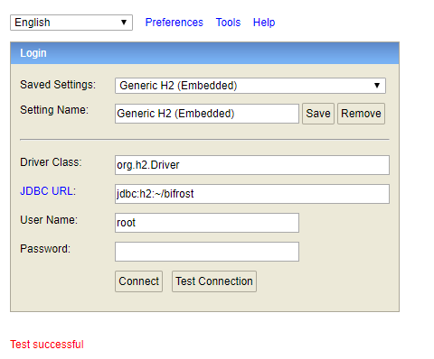
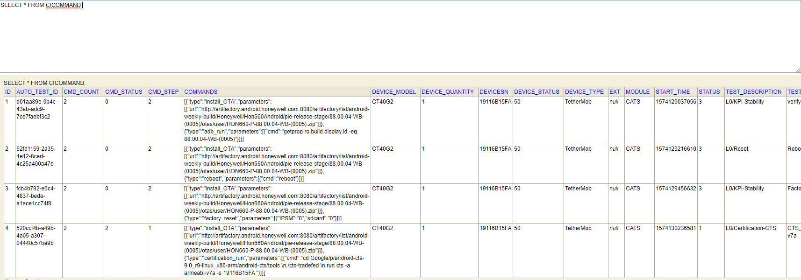
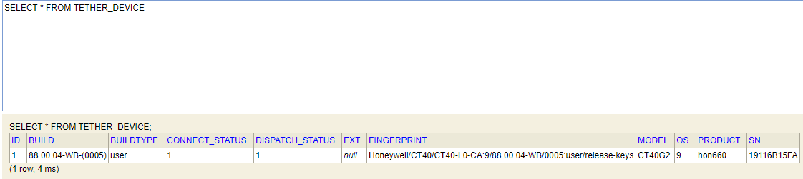

# CERTIFICATION {docsify-ignore-all}

## Test suit path config in table cats.bare_mental
| BARE_MENTAL_ID | BARE_MENTAL_SN | CERT_TYPE | AND_VERSION | CERT_VERSION | CERT_PATH | CERT_COMMAND | BARE_MENTAL_EXTRA |
| :----- | :----- | :----- | :----- | :----- | :----- | :----- | :----- |
|2| 5HR5822| CTS| P| R6| Google/p/android-cts-9.0_r6-linux_x86-arm/android-cts/tools| ./cts-tradefed| NULL |
|3| 5HR5822| CTS| P| R8| Google/p/android-cts-9.0_r8-linux_x86-arm/android-cts/tools| ./cts-tradefed| NULL |
|4| 5HR5822| CTS| O| R14| Google/O/CN85/android-cts/tools| ./cts-tradefed| NULL |
|5| 5HR5822| CTS| P| R9| Google/p/android-cts-9.0_r9-linux_x86-arm/android-cts/tools| ./cts-tradefed| NULL |
|6| 2VNHF3X| CTS| P| R9| Google/p/android-cts-9.0_r9-linux_x86-arm/android-cts/tools| ./cts-tradefed| NULL |

## Bare mental SSH config
```bash
username:swt 
password:HON123well
```
## Bare mental agent deploy
```bash
java -jar agent-0.0.1-SNAPSHOT.jar
```

## Certification test trigger interface
```http
POST http://172.31.48.11:8080/cats/certification/trigger/190
```

```json
{
    "product": {
        "productName": "Hon660"
        "deviceModel": "CT40G2"
        "androidVer": "P"
    }
    "os": {
        "targetURL": "http://artifactory.android.honeywell.com:8080/artifactory/list/android-weekly-build/Honeywell/Hon660Android/pie-release-stage/88.00.04-WB-(0005)/otas/user/HON660-P-88.00.04-WB-(0005).zip"
        "targetVer": "88.00.04-WB-(0005)"
        "branchFlag": 3
        "gmsFlag": true
        "userFlag": true
    }
    "testType": "CTS"
    "testVersion": "R9"
    "shard": 1
} 
```

## Real time log display
```bash

```
> [http://172.31.49.37/](http://172.31.49.37/)


## Trigger certification test flow
- launch bare mental agent
 - agent send tether devices info to server
 - agent save tether devices info into local database
 - use ddms library dynamically detect device connect status
- invoke certification test trigger interface
- trigger certification pipeline
- send test case commands to bare mental
- bare mental agent save commands to local database
- parse command one by one and execute it, then send result to server when complete

## Bare mental database
> [http://172.31.49.37:8082/h2-console](http://172.31.49.37:8082/h2-console)



```bash
JDBC URL  : jdbc:h2:~/bifrost
User Name : root
Password  : 123456
```
> Table TETHER_DEVICE



> Table CICOMMAND

