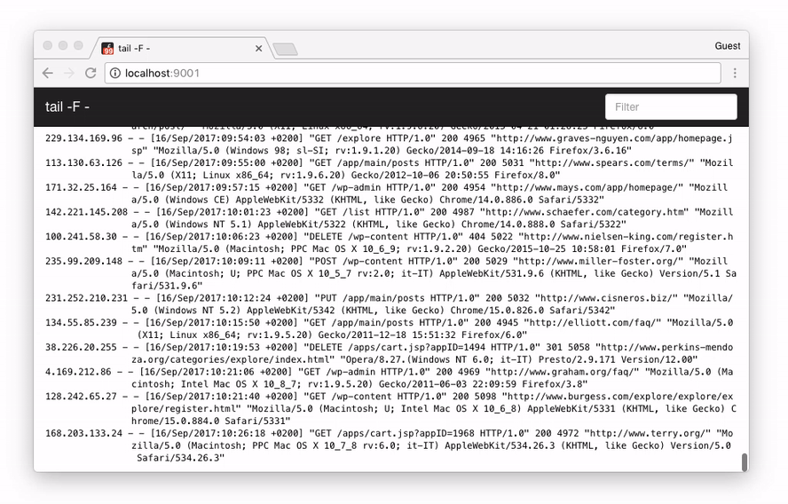

# FRONTAIL {docsify-ignore-all}

## frontail – streaming logs to the browser

`frontail` is a Node.js application for streaming logs to the browser. It's a `tail -F` with UI.

> [Connected real time log](http://cd.android.honeywell.com:9002/)

> [Bifrost real time log](http://cd.android.honeywell.com:9001/)