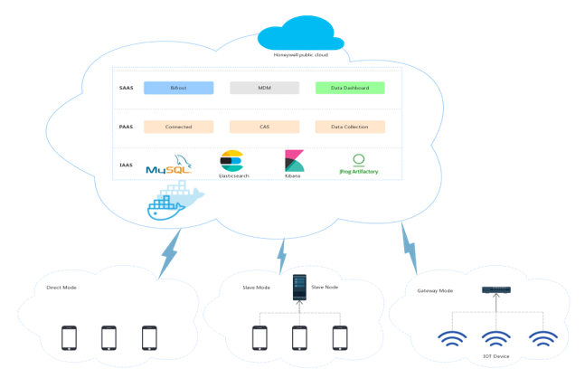

# OVERVIEW {docsify-ignore-all}
## What is Bifrost?
Welcome to Bifrost! Bifrost is a connected platform that performs automatic test on connected android devices and get test report without interference.

### Features
Bifrost's main features are:
- connectivity, android device and bare metals connect to the platform via websocket 
- automatically import test cases from HMTS(Honeywell Mobility Test Suit)
- pipeline, customize test case dispatch sequence with a more flexbile manner
- device tag, dispatch test case to device with proper device tag
- store test report and log and visualization in web portal

### Components
The Bifrost ecosystem consists of multiple components, many of which are optional:
- connected platform which manage android devices and bare metals connectivity
- Bifrost which trigger automatic tests on connected devices
- HMTS(Honeywell Mobility Test Suit), collection of Honeywell value added test cases
- Android device agent and Bare metal agent(mainly for CTS,GTS purpose)
- CAS(Single Sign On platform with Honeywell LDAP) and OTA(Service for query available OS images)
- Elastic stack(ElasticSearch Filebeat and Kibana), log&&report storage and query 

### Architecture
This diagram illustrates the architecture of Bifrost and some of its ecosystem components:

