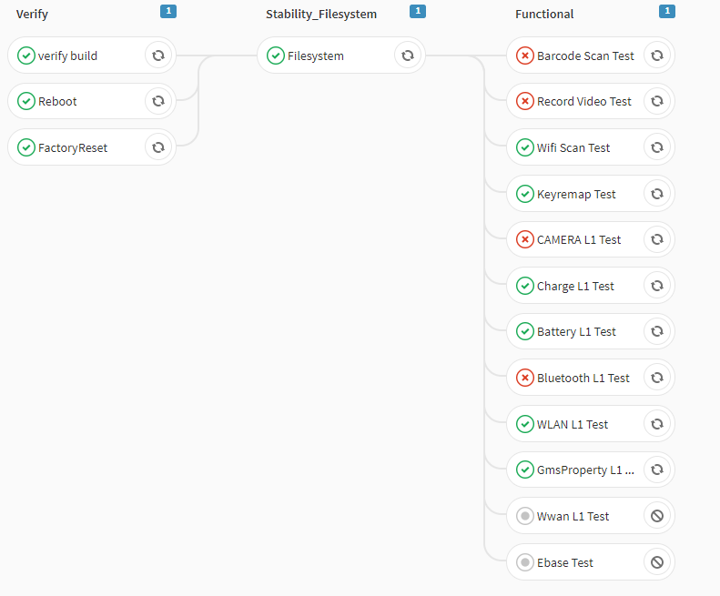

# PIPELINE
> [http://cd.android.honeywell.com:8080/cats/pipelineresult?id=11768](http://cd.android.honeywell.com:8080/cats/pipelineresult?id=11768)
### Pipeline glossary

- `Job`: Instructions that a runner has to execute(single test case).
- `Pipeline`: A collection of jobs split into different stages.
- `Runner`: An agent or server that executes each job individually that can spin up or down as needed.
- `Stages`: A keyword that defines certain stages of a job, such as `Verify` and `Stability_Filesystem`. Jobs of the same stage are executed in parallel.



### `cats.pipeline`
| PIPELINE_ID| PIPELINE_NAME| STATUS| BRANCH_ID| STAGE_LIST| PIPELINE_EXTRA |
| :----- | :----- | :----- | :----- | :----- | :----- |
|901| P(WB Colderest)| 1| 5| 1,21,2| WB_P |
|902| P(WB Factoryrest)| 1| 5| 1,22,2| WB_P |
|903| P(WB FTP)| 1| 5| 1,23,2| WB_P |
|904| P(WB CameraImage)| 1| 5| 1,24,2| WB_P |
|905| P(WB Filesystem)| 1| 5| 1,25,2| WB_P |
|906| P(WB WWAN)| 1| 5| 26,2| WB_P |
|907| P(WB RadioPower)| 1| 5| 1,27,2| WB_P |
|908| P(WB Speaker)| 1| 5| 1,28,2| WB_P |
|909| P(WB Ebase)| 1| 5| 1,29,2| WB_P |
|910| P(WB Monkey)| 1| 5| 1,31,2| WB_P |
|911| P(WB Camera)| 1| 5| 1,32,2| WB_P |
|912| P(WB Scanner)| 1| 5| 1,33,2| WB_P |
|913| P(WB Battery)| 1| 5| 1,34,2| WB_P |
|914| P(WB OTA)| 1| 5| 1,35,2| WB_P |

### `cats.stage`
| STAGE_ID| STAGE_NAME| STATUS| IS_PARALLEL| PARALLEL| RETRY| ALLOW_FAILURE| BY_CASE_LEVEL| CASE_LEVEL| JOB_LIST| NEED_COMPLETE| STAGE_EXTRA |
| :----- | :----- | :----- | :----- | :----- | :----- | :----- | :----- | :----- | :----- | :----- | :----- |
| 1| Verify| 1| 0| 1| 0| 0| 1| L0| NULL | 1| NULL |
| 2| Functional| 1| 1| 1| 0| 1| 1| L1,L2| NULL | 1| NULL |
| 21| Stability_ColdReset| 1| 1| 1| 0| 1| 0| L5| ColdReset| 0| NULL |
| 22| Stability_FactoryReset| 1| 1| 1| 0| 1| 0| L5| FactoryReset| 0| NULL |
| 23| Stability_FTP| 1| 1| 1| 0| 1| 0| L5| FTP| 0| NULL |
| 24| Stability_CameraImage| 1| 1| 1| 0| 1| 0| L5| CameraImage| 0| NULL |
| 25| Stability_Filesystem| 1| 1| 1| 0| 1| 0| L5| Filesystem| 0| NULL |
| 26| Stability_WWAN| 1| 1| 1| 0| 1| 0| L5| Wwan Stress Test| 0| NULL |
| 27| Stability_RadioPower| 1| 1| 1| 0| 1| 0| L5| RadioPower| 0| NULL |
| 28| Stability_SpeakerTest| 1| 1| 1| 0| 1| 0| L5| SpeakerTest| 0| NULL |
| 29| Stability_EBase| 1| 1| 1| 0| 1| 0| L5| EBase| 0| NULL |
| 31| Stability_Monkey| 1| 1| 1| 0| 1| 0| L5| Monkey| 0| NULL |
| 32| Stability_Camera| 1| 1| 1| 0| 1| 0| L5| CAMERA L5 Test| 0| NULL |
| 33| Stability_Scanner| 1| 1| 1| 0| 1| 0| L3| Scanner Test| 0| NULL |
| 34| Stability_Battery| 1| 1| 1| 0| 1| 0| L3| Battery Life Test| 0| NULL |
| 35| Stability_OTA_WB| 1| 1| 1| 0| 1| 0| L5| WeeklyOtaUpdate| 0| NULL |
| 180| CTS_O_armeabi-v7a| 1| 0| 1| 0| 0| 0| L8| CTS_O_armeabi-v7a| 1| NULL |
| 181| CTS_Retry_O| 1| 0| 1| 0| 0| 0| L8| CTS_Retry_O| 1| NULL |
| 190| CTS_P_armeabi-v7a| 1| 0| 1| 0| 0| 0| L8| CTS_P_armeabi-v7a| 1| NULL |
| 191| CTS_Retry_P| 1| 0| 1| 0| 0| 0| L8| CTS_Retry_P| 1| NULL |
| 192| CTS_P_arm64-v8a| 1| 0| 1| 0| 0| 0| L8| CTS_P_arm64-v8a| 1| NULL |

### Stage configuration parameters
| Keyword| Description|
| :----- | :----- |
| `IS_PARALLEL`|Parallel dispatch jobs in current stage. `1:true 0:false`|
| `PARALLEL`|How many instances of a job should be run in parallel.|
| `RETRY`|When and how many times a job can be auto-retried in case of a failure. `TODO`|
| `ALLOW_FAILURE`| Allow job to fail. |
| `BY_CASE_LEVEL`| Select jobs by test case level. `1:true 0:false` |
| `CASE_LEVEL`| Test case level. `L0:Platform L1:Smoking L2:Functional L3:Performance L4:NULL L5:Stress L6:CommonES L7:MDM L8:Certification` |
| `JOB_LIST`| Test case name when BY_CASE_LEVEL=0. |
| `NEED_COMPLETE`|  Whether dispatch following stage if current stage is incomplete. `1:true 0:false` |

### `cats.pipeline_job_relation`
| PIPELINE_RESULT_ID| PIPELINE_ID| STATUS| START_TIME| END_TIME| PRODUCT_NAME| DEVICE_MODEL| ANDROID_VER| OS_SPECIFIC| OS_URL| OS_VERSION| CURRENT_STAGE| BRANCH_FLAG| GMS_FLAG| USER_FLAG| IS_INCRE| IS_CERT| PIPE_TYPE| PIPELINE_RESULT_EXTRA |
| :----- | :----- | :----- | :----- | :----- | :----- | :----- | :----- | :----- | :----- | :----- | :----- | :----- | :----- | :----- | :----- | :----- | :----- | :----- | 
|11768| 905| 6| 1573207279330| NULL| Hon660| CT60| P| 1| http://artifactory.android.honeywell.com:8080/artifactory/android-weekly-build/Honeywell/Hon660Android/pie-release-stage/88.00.04-WB-(0004)/otas/user/HON660-P-88.00.04-WB-(0004).zip| 88.00.04-WB-(0004)| 2| 0| 1| 1| 0| 0| 0| NULL |


### `cats.pipeline_job_relation`

| PIPELINE_JOB_RELATION_ID| PIPELINE_RESULT_ID| STAGE_ID| STAGE_INDEX| STAGE_COUNT| JOB_INDEX| JOB_COUNT| JOB_ID| JOB_STATUS| PIPELINE_JOB_RELATION_EXTRA |
| :----- | :----- | :----- | :----- | :----- | :----- | :----- | :----- | :----- | :----- |
|13093| 11768| 1| 0| 3| 0| 3| 0a424e46-35b7-49fb-b90d-a03df6287a6c| 1| NULL |
|13100| 11768| 1| 0| 3| 1| 3| a7bdc9eb-38f8-4adb-8951-f748f6571f19| 1| NULL |
|13103| 11768| 1| 0| 3| 2| 3| 12b02d76-95ea-466b-9eb3-57d7cc0a65d4| 1| NULL |
|13105| 11768| 25| 1| 3| 0| 1| 52e17fa0-7d17-4235-aded-53d186ae2d94| 1| NULL |
|13129| 11768| 2| 2| 3| 0| 12| 3e74a08b-48d9-4d66-a436-ae122ede81f4| 1| NULL |
|13131| 11768| 2| 2| 3| 1| 12| 97225a18-9fdb-4453-bf66-86e07033f075| 1| NULL |
|13136| 11768| 2| 2| 3| 2| 12| 8ec0a715-cf22-4b15-adb8-de2c978a703b| 1| NULL |
|13137| 11768| 2| 2| 3| 3| 12| 7c74ed5e-31e2-42c9-ad2b-37dd0909c49a| 1| NULL |
|13138| 11768| 2| 2| 3| 4| 12| 767db253-1212-4e2b-90ec-f3183fa04ac0| 1| NULL |
|13139| 11768| 2| 2| 3| 5| 12| 71a4deff-1525-4a33-8e59-0d08c6d62073| 1| NULL |
|13140| 11768| 2| 2| 3| 6| 12| dae1cbd8-0646-47fe-9c57-48c07d7c3543| 1| NULL |
|13141| 11768| 2| 2| 3| 7| 12| 4e43376f-ecf5-4501-ba0a-67f55cd300d6| 1| NULL |
|13142| 11768| 2| 2| 3| 8| 12| cb7eefa2-ae77-43fc-afa8-b23783b4ab30| 1| NULL |
|13143| 11768| 2| 2| 3| 9| 12| 966c0cc8-f2ac-4fd4-abe6-c17f38bef485| 1| NULL |

## Pipeline trigger interface
```http
POST http://cd.android.honeywell.com:8080/cats/pipeline/trigger/905
```

```json
{
    "productName": "Hon660",
    "deviceModel": "CT40",
    "androidVer": "P",
    "osUrl": "http://artifactory.android.honeywell.com:8080/artifactory/list/android-weekly-build/Honeywell/Hon660Android/pie-release-stage/88.00.04-WB-(0005)/otas/user/HON660-P-88.00.04-WB-(0005).zip",
    "osVersion": "88.00.04-WB-(0005)",
    "branchFlag": 3,
    "gmsFlag": true,
    "userFlag": true
}
```
> branchFlag: `0:master 1:release 2:commit 3:weekly`


## Pipeline dispatch algorithm


