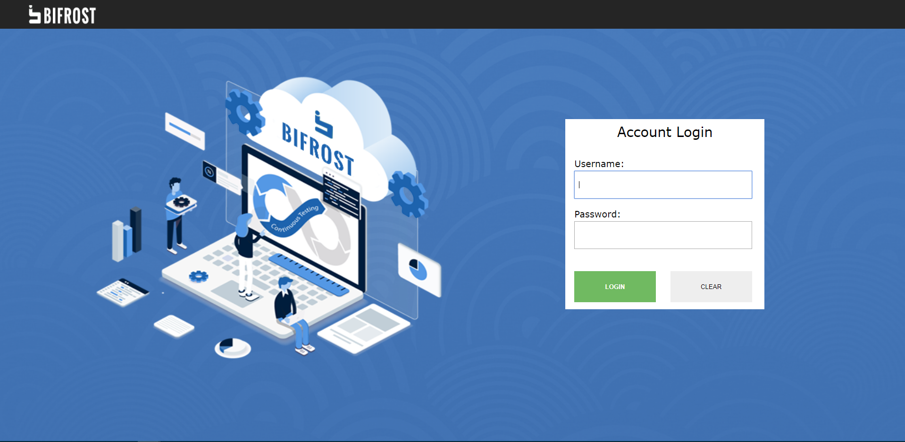

# SSO {docsify-ignore-all}
> Single sign-on (SSO) is a property of access control of multiple related, yet independent, software systems. With this property, a user logs in with a single ID and password to gain access to any of several related systems. It is often accomplished by using the Lightweight Directory Access Protocol (LDAP) and stored LDAP databases on (directory) servers.

## CAS
> [CAS](https://www.apereo.org/projects/cas) Enterprise Single Sign-On - CAS provides a friendly open source community that actively supports and contributes to the project. While the project is rooted in higher-ed open source, it has grown to an international audience spanning Fortune 500 companies and small special-purpose installations.

## CAS with Honeywell LDAP
> In our case, we use login in our systems(bifrost, dashboard, assetmanager and etc) without multiple login operations.

